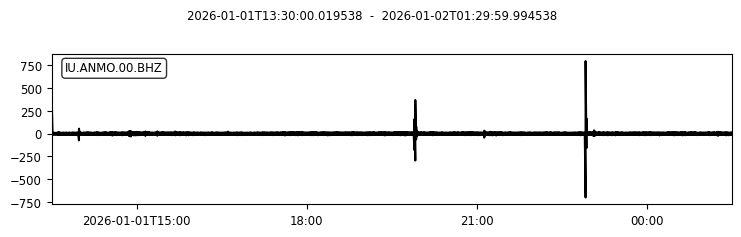
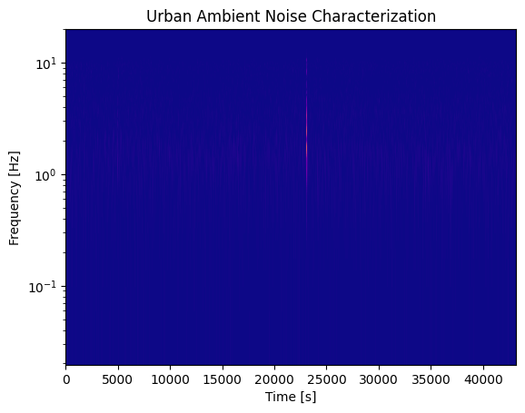
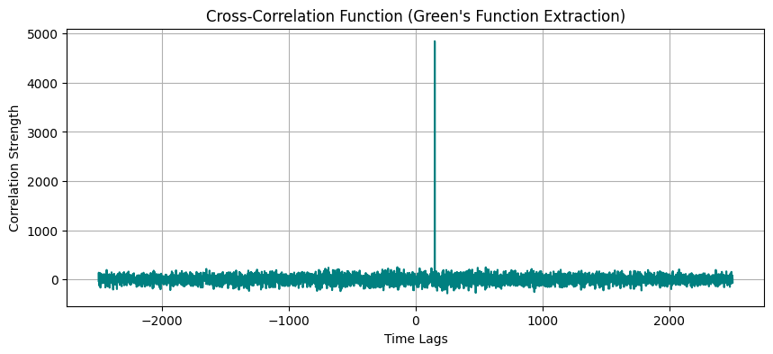
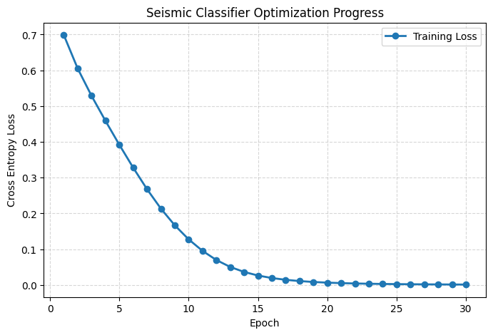
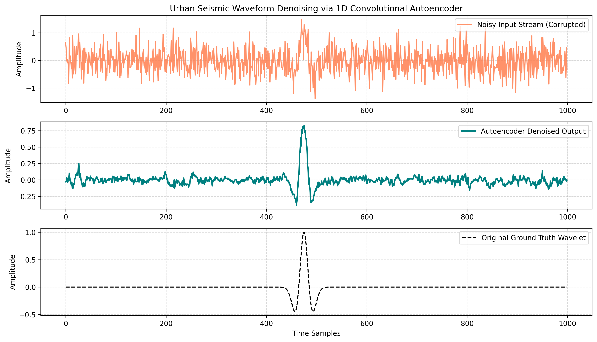
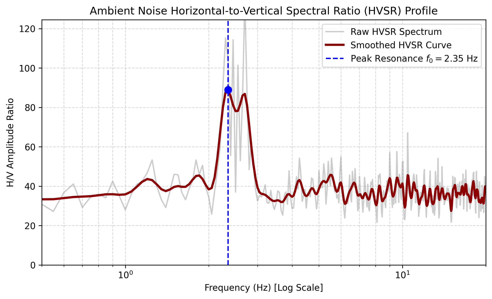

# Passive Seismic Analytics & Deep Learning Portfolio
An exploratory data science repository focusing on time-series processing, passive seismology, and deep learning architectures for environmental geophysics and smart city applications. This portfolio serves as technical preparation for scaling up discrete geophone instrumentation methodologies into high-density Distributed Acoustic Sensing (DAS) frameworks.

---

## 📂 Repository Directory Layout
```text
seismic-analytics-portfolio/
├── data/
│   ├── .gitkeep              # Placeholder folder for downloaded seismic files
│   └── synthetic_das_record.h5 # Synthetic multi-channel DAS array dataset
├── images/
│   ├── step1_spectrogram.png # Spectrogram plot
│   ├── step2_cross_corr.png  # Cross-correlation plot
│   ├── step3_loss_curve.png  # Training execution loss curve plot
│   ├── step4_das_waterfall.png # DAS 2D spatiotemporal waterfall plot
│   ├── step5_denoising_autoencoder.png # Autoencoder signal denoising plot
│   └── step6_hvsr_profiling.png # HVSR spectral ratio profiling plot
├── notebooks/
│   ├── 01_obspy_data_query.ipynb
│   ├── 02_ambient_noise_cross_corr.ipynb
│   ├── 03_pytorch_seismic_classifier.ipynb
│   ├── 04_das_hdf5_processing.ipynb
│   ├── 05_seismic_denoising_autoencoder.ipynb
│   └── 06_ambient_hvsr_profiling.ipynb
├── .gitignore
├── LICENSE
└── README.md
```

## 🚀 Technical Implementation Modules & Source Code
### Module 1: Automated Broadband Data Acquisition & Spectral Analysis
This module establishes a connection to the EarthScope FDSN web services utilizing ```ObsPy``` to programmatically ingest raw seismic waveforms. The script demeans, detrends, and filters raw streams to isolate urban cultural background noise, visualizing changes via signal spectrograms.

```python
import obspy
from obspy.clients.fdsn import Client
from obspy import UTCDateTime
import matplotlib.pyplot as plt

#Connection to the EarthScope Web Service client
client = Client("EARTHSCOPE")

#defining a time window
starttime = UTCDateTime("2026-01-01T13:30:00")
endtime = starttime + 43200  #12  hours

#Downloading data from a real seismic station. Here, Network: IU, Station: ANMO
st = client.get_waveforms("IU", "ANMO", "00", "BHZ", starttime, endtime)
tr = st[0]  #for the primary trace

#Demean & Detrend
tr.detrend("demean")
tr.detrend("linear")

#Applying bandpass filter targeting typical urban cultural noise (1.0 - 10.0 Hz)
tr.filter("bandpass", freqmin=1.0, freqmax=10.0)

#Plotting the waveform & its spectrogram
tr.plot()
tr.spectrogram(
    log=True,          # Logarithmic amplitude scale
    title="Urban Ambient Noise Characterization",
    cmap='plasma',     # Change color scheme here
)
```

### Expected Visual Output:

<table align="center" border="0">
  <tr>
    <td align="center">
      
    </td>
    <td align="center">
      
    </td>
  </tr>
  <tr>
    <td colspan="2" align="center">
      <sub>Figure 1: Time-series waveform trace alongside its corresponding logarithmic power spectral density (PSD) spectrogram highlighting steady ambient urban frequencies.</sub>
    </td>
  </tr>
</table>

### Module 2: Ambient Noise Cross-Correlation (Green's Function Extraction)
To replicate subsurface geohazard detection techniques (such as mapping subsidence or sinkholes), this module runs spatial cross-correlations over parallel continuous noise streams. This process evaluates phase shifts and travel time delays between discrete sensor channels along a structural path.

```python
import numpy as np
import scipy.signal as signal
import matplotlib.pyplot as plt

#Simulating continuous ambient noise at two different virtual fiber sensors (DAS channels)
np.random.seed(42)
common_ambient_noise = np.random.normal(0, 1, 5000)

#Let Sensor B be further down the road, so it experiences a time delay (phase shift)
sensor_a_data = common_ambient_noise + np.random.normal(0, 0.5, 5000)
sensor_b_data = np.roll(common_ambient_noise, 150) + np.random.normal(0, 0.5, 5000) 

#Performing cross-correlation to find the seismic wave travel time between sensors
correlation = signal.correlate(sensor_b_data, sensor_a_data, mode='same')
lags = signal.correlation_lags(len(sensor_b_data), len(sensor_a_data), mode='same')

#Finding the peak lag time 
max_idx = np.argmax(correlation)
time_delay = lags[max_idx]
print(f"Empirical Wave Travel Time (Lags): {time_delay} samples")

#Plotting the result (stack to image sinkholes/fault lines)
plt.figure(figsize=(10, 4))
plt.plot(lags, correlation, color='teal')
plt.title("Cross-Correlation Function (Green's Function Extraction)")
plt.xlabel("Time Lags")
plt.ylabel("Correlation Strength")
plt.grid(True)
plt.show()
```

<p align="center">
  
  <br />
  <sub>Figure 2: Empirical Green's Function recovery displaying clear travel time lag symmetry, isolating coherent signal features out of stochastic ambient vibrations.</sub>
</p>

### Module 3: 1D Temporal Convolutional Neural Networks (CNN) Optimization
Dense DAS architectures generate terabytes of high-frequency data daily, requiring automated event picking. This module defines a deep 1D Convolutional Neural Network built with ```PyTorch``` utilizing batch normalization, max-pooling, and adaptive average pooling layers. It runs a multi-epoch optimization loop tracking cross-entropy loss convergence to simulate model verification.

```python
import torch
import torch.nn as nn
import torch.optim as optim
import matplotlib.pyplot as plt  

#Defining a 1D CNN Architecture suitable for dense DAS arrays or geophone data
class SeismicClassifier(nn.Module):
    def __init__(self):
        super(SeismicClassifier, self).__init__()
        self.features = nn.Sequential(
            nn.Conv1d(in_channels=1, out_channels=16, kernel_size=15, stride=2, padding=7),
            nn.BatchNorm1d(16),
            nn.ReLU(),
            nn.MaxPool1d(kernel_size=2),
            
            nn.Conv1d(16, 32, kernel_size=7, stride=2, padding=3),
            nn.BatchNorm1d(32),
            nn.ReLU(),
            nn.AdaptiveAvgPool1d(1)  # to flatten down the time dimension
        )
        self.classifier = nn.Linear(32, 2) # Binary Classification: 0 = Traffic Noise, 1 = Hazard

    def forward(self, x):
        x = self.features(x)
        x = x.view(x.size(0), -1)
        x = self.classifier(x)
        return x

#Instantiating dummy data mimicking a continuous wave (Batch Size = 4, Channels = 1, Time Samples = 1000)
dummy_seismic_stream = torch.randn(4, 1, 1000)
labels = torch.tensor([0, 1, 0, 1], dtype=torch.long)

model = SeismicClassifier()
criterion = nn.CrossEntropyLoss()
optimizer = optim.Adam(model.parameters(), lr=0.01) # Bumped learning rate slightly for faster toy convergence

#Simulating a multi-epoch training loop to gather historical data for the curve
num_epochs = 30
loss_history = []

print("Starting training loop...")
for epoch in range(num_epochs):
    optimizer.zero_grad()
    outputs = model(dummy_seismic_stream)
    loss = criterion(outputs, labels)
    loss.backward()
    optimizer.step()
    
    # to store the loss scalar value
    loss_history.append(loss.item())
    
    if (epoch + 1) % 5 == 0 or epoch == 0:
        print(f"Epoch [{epoch+1}/{num_epochs}] - Current Loss: {loss.item():.4f}")

print("\nTraining Complete. Generating loss curve...")

#Plotting and saving the execution outputs
plt.figure(figsize=(8, 5))
plt.plot(range(1, num_epochs + 1), loss_history, marker='o', color='#1f77b4', linewidth=2, label='Training Loss')
plt.title('Seismic Classifier Optimization Progress')
plt.xlabel('Epoch')
plt.ylabel('Cross Entropy Loss')
plt.grid(True, linestyle='--', alpha=0.5)
plt.legend()
plt.show()

plt.savefig('step3_loss_curve.png', dpi=300, bbox_inches='tight')
plt.close()

print("File successfully saved as 'step3_loss_curve.png'")
```

SeismicClassifier Flow Diagram:

```SeismicClassifier Flow Diagram:<br />
Input [Batch, 1, 1000] ──> Conv1D (k=15, s=2) ──> BatchNorm ──> ReLU ──> MaxPool<br />
                       ──> Conv1D (k=7, s=2)  ──> BatchNorm ──> ReLU ──> AdaptiveAvgPool<br />
                       ──> Linear Layer ──────> Output [Batch, 2] (Class Logits)
```

<p align="center">
  
  <br />
  <sub>Figure 3: Multi-epoch gradient descent minimization profile demonstrating mathematical stability during spatial waveform feature categorization.</sub>
</p>

### Module 4: High-Density Distributed Acoustic Sensing (DAS) HDF5 Data Analytics
DAS turns fiber-optic infrastructure into thousands of virtual strain sensors, generating multi-channel 2D spatiotemporal matrices stored in high-performance HDF5 binary structures. This module parses multi-channel HDF5 datasets using ```h5py```, extracts metadata attributes, and generates 2D spatiotemporal strain-rate "waterfall" profiles to track wave propagation across fiber channels.

```
import os
import h5py
import numpy as np
import matplotlib.pyplot as plt

#1 Generating & writing Synthetic DAS Array Data to an HDF5 File
os.makedirs('../data', exist_ok=True)
os.makedirs('../images', exist_ok=True)
h5_filepath = '../data/synthetic_das_record.h5'

num_channels = 500      # 500 virtual sensors along a 1 km fiber (2m spacing)
num_time_samples = 2000  # 10 seconds of recording at 200 Hz
sampling_rate = 200.0   # Hz
wave_velocity = 300.0   # Seismic wave speed (m/s)

time_axis = np.linspace(0, num_time_samples / sampling_rate, num_time_samples)
channel_positions = np.arange(num_channels) * 2.0  # Distance in meters

#Constructing a spatiotemporal wave field: A wave traveling across fiber channels
das_data_matrix = np.zeros((num_channels, num_time_samples))
np.random.seed(42)

for ch_idx, distance in enumerate(channel_positions):
    # Calculating travel time delay for wave to reach this specific channel
    time_delay = distance / wave_velocity
    
    # Ricker wavelet-like seismic signal propagating across channels
    t_shifted = time_axis - time_delay - 1.0  # 1s initial delay
    signal = (1 - 2 * (np.pi * 5 * t_shifted)**2) * np.exp(-(np.pi * 5 * t_shifted)**2)
    
    # Adding ambient urban background noise
    noise = np.random.normal(0, 0.15, num_time_samples)
    das_data_matrix[ch_idx, :] = signal + noise

# Writing matrix and metadata to HDF5 binary file
with h5py.File(h5_filepath, 'w') as h5f:
    # Creating main raw data group and dataset
    raw_group = h5f.create_group('raw_data')
    dset = raw_group.create_dataset('strain_rate', data=das_data_matrix, compression="gzip")
    
    # Storing essential metadata attributes
    dset.attrs['sampling_rate_hz'] = sampling_rate
    dset.attrs['channel_spacing_m'] = 2.0
    dset.attrs['units'] = 'nanostrain/s'

print(f"HDF5 DAS File created successfully: '{h5_filepath}'")


#2 Reading & Parse the HDF5 DAS Array File
with h5py.File(h5_filepath, 'r') as h5f:
    # Reading dataset and metadata from HDF5 structure
    das_matrix = h5f['raw_data/strain_rate'][:]
    fs = h5f['raw_data/strain_rate'].attrs['sampling_rate_hz']
    dx = h5f['raw_data/strain_rate'].attrs['channel_spacing_m']
    units = h5f['raw_data/strain_rate'].attrs['units']

print(f"Loaded DAS Matrix Shape: {das_matrix.shape} (Channels x Time Samples)")
print(f"Metadata: Sampling Rate = {fs} Hz, Channel Spacing = {dx} m")


#3 Generating 2D DAS Spatiotemporal Waterfall Plot
plt.figure(figsize=(10, 6))

# Displaying 2D spatiotemporal strain rate matrix
time_extent = [0, num_time_samples / fs]
distance_extent = [0, num_channels * dx]

plt.imshow(
    das_matrix, 
    aspect='auto', 
    cmap='seismic', 
    extent=[time_extent[0], time_extent[1], distance_extent[1], distance_extent[0]],
    vmin=-0.8, vmax=0.8
)

plt.colorbar(label=f'Strain Rate ({units})')
plt.title('Spatiotemporal DAS Fiber Array Record (2D Waterfall Plot)')
plt.xlabel('Time (seconds)')
plt.ylabel('Distance along Fiber Cable (meters)')
plt.grid(True, linestyle='--', alpha=0.3)

# Saving the plot
output_plot_path = '../images/step4_das_waterfall.png'
plt.savefig(output_plot_path, dpi=300, bbox_inches='tight')
plt.show()

print(f"DAS Waterfall visualization successfully saved to '{output_plot_path}'")
```
<p align="center">
  
  <br />
  <sub>Figure 4: 2D DAS spatiotemporal strain-rate record displaying a coherent seismic wavefront propagating across 500 spatial channels over a 1 km fiber section.</sub>
</p>

### Module 5: 1D Convolutional Autoencoder for Seismic Signal Denoising
Continuous urban fiber-optic sensing captures significant cultural noise (traffic, machinery, power lines) that masks low-amplitude seismic arrivals. This module implements an unsupervised 1D Convolutional Autoencoder (CAE) in ```PyTorch```. By compressing time-series waveforms into a low-dimensional latent space and reconstructing them through transposed/upsampling convolutional layers, the architecture suppresses uncorrelated background noise while preserving wave arrival profiles.

```
import os
import torch
import torch.nn as nn
import torch.optim as optim
import numpy as np
import matplotlib.pyplot as plt


os.makedirs('../images', exist_ok=True)  #Ensures target directories exist


#1 Defining the 1D Convolutional Autoencoder Architecture

class SeismicDenoisingAutoencoder(nn.Module):
    def __init__(self):
        super(SeismicDenoisingAutoencoder, self).__init__()
        
        # Encoder: Compresses 1000 time-series samples down to a latent space
        self.encoder = nn.Sequential(
            nn.Conv1d(1, 16, kernel_size=7, stride=1, padding=3),
            nn.BatchNorm1d(16),
            nn.ReLU(),
            nn.MaxPool1d(kernel_size=2),  # Shape: [Batch, 16, 500]
            
            nn.Conv1d(16, 32, kernel_size=7, stride=1, padding=3),
            nn.BatchNorm1d(32),
            nn.ReLU(),
            nn.MaxPool1d(kernel_size=2)   # Shape: [Batch, 32, 250]
        )
        
        # Decoder: Reconstructs clean signal back to original size [Batch, 1, 1000]
        self.decoder = nn.Sequential(
            nn.Upsample(scale_factor=2, mode='nearest'), # Shape: [Batch, 32, 500]
            nn.Conv1d(32, 16, kernel_size=7, stride=1, padding=3),
            nn.BatchNorm1d(16),
            nn.ReLU(),
            
            nn.Upsample(scale_factor=2, mode='nearest'), # Shape: [Batch, 16, 1000]
            nn.Conv1d(16, 1, kernel_size=7, stride=1, padding=3)
        )

    def forward(self, x):
        latent = self.encoder(x)
        reconstructed = self.decoder(latent)
        return reconstructed


#2 Generating Synthetic Ground Truth & Heavy Noisy Seismic Data

np.random.seed(42)
torch.manual_seed(42)

num_samples = 200
signal_len = 1000
t = np.linspace(-1, 1, signal_len)

clean_signals = []
noisy_signals = []

for _ in range(num_samples):
    # Random shift and frequency for synthetic Ricker-like seismic pulse
    shift = np.random.uniform(-0.3, 0.3)
    freq = np.random.uniform(10, 20)
    pulse = (1 - 2 * (np.pi * freq * (t - shift))**2) * np.exp(-(np.pi * freq * (t - shift))**2)
    
    # Heavy urban background noise
    noise = np.random.normal(0, 0.4, signal_len)
    
    clean_signals.append(pulse)
    noisy_signals.append(pulse + noise)

# Converting to PyTorch Tensors [Batch, Channels, Length]
X_clean = torch.tensor(np.array(clean_signals), dtype=torch.float32).unsqueeze(1)
X_noisy = torch.tensor(np.array(noisy_signals), dtype=torch.float32).unsqueeze(1)


#3 Training the Autoencoder Model

model = SeismicDenoisingAutoencoder()
criterion = nn.MSELoss()
optimizer = optim.Adam(model.parameters(), lr=0.003)

epochs = 60
print("Training 1D Convolutional Denoising Autoencoder...")

for epoch in range(epochs):
    optimizer.zero_grad()
    outputs = model(X_noisy)
    
    # Loss is calculated against the CLEAN ground truth target
    loss = criterion(outputs, X_clean)
    loss.backward()
    optimizer.step()
    
    if (epoch + 1) % 10 == 0:
        print(f"Epoch [{epoch+1}/{epochs}] - Reconstruction MSE Loss: {loss.item():.6f}")


#4 Visualizing & Saving Denoising Results

model.eval()
with torch.no_grad():
    denoised_outputs = model(X_noisy).numpy()

test_idx = 5  # Picking a sample wave to plot

plt.figure(figsize=(12, 7))

# Plot 1: Noisy Input Signal
plt.subplot(3, 1, 1)
plt.plot(X_noisy[test_idx, 0, :].numpy(), color='coral', alpha=0.85, label='Noisy Input Stream (Corrupted)')
plt.title('Urban Seismic Waveform Denoising via 1D Convolutional Autoencoder')
plt.ylabel('Amplitude')
plt.grid(True, linestyle='--', alpha=0.5)
plt.legend(loc='upper right')

# Plot 2: Cleaned Output from Autoencoder
plt.subplot(3, 1, 2)
plt.plot(denoised_outputs[test_idx, 0, :], color='teal', linewidth=2, label='Autoencoder Denoised Output')
plt.ylabel('Amplitude')
plt.grid(True, linestyle='--', alpha=0.5)
plt.legend(loc='upper right')

# Plot 3: Ground Truth Target
plt.subplot(3, 1, 3)
plt.plot(X_clean[test_idx, 0, :].numpy(), color='black', linestyle='--', label='Original Ground Truth Wavelet')
plt.xlabel('Time Samples')
plt.ylabel('Amplitude')
plt.grid(True, linestyle='--', alpha=0.5)
plt.legend(loc='upper right')

plt.tight_layout()

output_plot_path = '../images/step5_denoising_autoencoder.png'
plt.savefig(output_plot_path, dpi=300, bbox_inches='tight')
plt.show()

print(f"Denoising plot successfully saved to '{output_plot_path}'")
```


<p align="center">
  
  <br />
  <sub>Figure 5: Three-tier signal decomposition comparing noisy corrupted inputs, the autoencoder reconstructed output, and the original ground-truth seismic pulse.</sub>
</p>

### Module 6: Passive HVSR Spectral Profiling for Subsurface & Geohazard Characterization

Urban subsurface characterization and subsidence detection rely on passive ambient seismic noise to map soil–bedrock impedance contrasts. This module implements the **Horizontal-to-Vertical Spectral Ratio (HVSR)**, also known as **Nakamura's Method**, using 3-component ambient seismic noise recordings.

By computing cross-component **Power Spectral Densities (PSD)** using **Welch's method**, the workflow estimates the **Horizontal-to-Vertical (H/V) Spectral Ratio** to determine the **fundamental site resonance frequency** ($f_0$), an important indicator for site characterization and seismic hazard assessment.

#### Methodology
The horizontal spectrum is computed by combining the East and North components, while the vertical component is used as the denominator:

<div align="center">

$$  
\mathrm{H/V}(f)=
\frac{\sqrt{S_{\mathrm{East}}(f)^2 + S_{\mathrm{North}}(f)^2}}
{S_{\mathrm{Vertical}}(f)}
$$

</div>

where:

- $S_{\mathrm{East}}(f)$ = Power Spectral Density (PSD) of the East component
- $S_{\mathrm{North}}(f)$ = Power Spectral Density (PSD) of the North component
- $S_{\mathrm{Vertical}}(f)$ = Power Spectral Density (PSD) of the Vertical component
- $f$ = Frequency (Hz)

The dominant peak of the H/V curve corresponds to the **fundamental resonance frequency** ($f_0$), which is commonly associated with the impedance contrast between unconsolidated soil layers and underlying bedrock.

```
import os
import numpy as np
import scipy.signal as signal
import matplotlib.pyplot as plt


os.makedirs('../images', exist_ok=True)     # Ensures output directories exist


#1 Generating Synthetic 3-Component Ambient Noise Data

np.random.seed(42)

sampling_rate = 100.0  # Hz
duration = 300.0       # 5 minutes of continuous recording
num_samples = int(sampling_rate * duration)
time = np.linspace(0, duration, num_samples)

# Simulating background urban white noise
noise_v = np.random.normal(0, 0.2, num_samples)  # Vertical
noise_e = np.random.normal(0, 0.2, num_samples)  # East-West
noise_n = np.random.normal(0, 0.2, num_samples)  # North-South

# Injecting site resonance around f0 = 2.5 Hz (typical soft soil layer over bedrock)
res_freq = 2.5  # Hz
resonance_signal = 0.8 * np.sin(2 * np.pi * res_freq * time) * np.exp(-((time % 10 - 5)**2) / 4)

# Horizontal channels experience strong resonance amplification due to shear waves
data_v = noise_v + 0.2 * resonance_signal
data_e = noise_e + 1.2 * resonance_signal
data_n = noise_n + 1.1 * resonance_signal


#2 Computingf Power Spectral Density (PSD) using Welch's Method

nperseg = int(sampling_rate * 20)  # 20-second windows for smooth averaging

freqs, psd_v = signal.welch(data_v, fs=sampling_rate, nperseg=nperseg)
_, freqs_e = signal.welch(data_e, fs=sampling_rate, nperseg=nperseg)[1], None
_, psd_e = signal.welch(data_e, fs=sampling_rate, nperseg=nperseg)
_, psd_n = signal.welch(data_n, fs=sampling_rate, nperseg=nperseg)

# Calculating combined horizontal amplitude: H = sqrt(E^2 + N^2)
psd_h = np.sqrt((psd_e + psd_n) / 2.0)

# Calculating H/V Ratio
hvsr_ratio = psd_h / (psd_v + 1e-8)  # Adding small epsilon to avoid division by zero

# Smooth HVSR curve using a moving average Gaussian filter
window_len = 11
kernel = np.exp(-np.linspace(-2, 2, window_len)**2)
kernel /= kernel.sum()
hvsr_smoothed = np.convolve(hvsr_ratio, kernel, mode='same')

# Identifying fundamental site resonance frequency (f0)
freq_mask = (freqs >= 0.5) & (freqs <= 10.0)
valid_freqs = freqs[freq_mask]
valid_hvsr = hvsr_smoothed[freq_mask]

f0_idx = np.argmax(valid_hvsr)
f0 = valid_freqs[f0_idx]
peak_amplitude = valid_hvsr[f0_idx]

print(f"Subsurface Characterization Complete:")
print(f"Identified Fundamental Resonance Frequency (f0): {f0:.2f} Hz")
print(f"Peak H/V Amplitude Ratio: {peak_amplitude:.2f}")


#3 Plotting and Saving Publication-Quality HVSR Profile

plt.figure(figsize=(9, 5))

# Plot raw vs smoothed HVSR
plt.plot(freqs, hvsr_ratio, color='gray', alpha=0.4, label='Raw HVSR Spectrum')
plt.plot(freqs, hvsr_smoothed, color='darkred', linewidth=2.5, label='Smoothed HVSR Curve')

# Highlight peak f0
plt.axvline(x=f0, color='blue', linestyle='--', linewidth=1.5, label=f'Peak Resonance $f_0 = {f0:.2f}$ Hz')
plt.scatter([f0], [peak_amplitude], color='blue', zorder=5, s=60)

plt.xscale('log')
plt.xlim(0.5, 20.0)
plt.ylim(0, max(hvsr_smoothed[freq_mask]) * 1.4)

plt.title('Ambient Noise Horizontal-to-Vertical Spectral Ratio (HVSR) Profile', fontsize=12)
plt.xlabel('Frequency (Hz) [Log Scale]', fontsize=10)
plt.ylabel('H/V Amplitude Ratio', fontsize=10)
plt.grid(True, which='both', linestyle='--', alpha=0.5)
plt.legend(loc='upper right')

output_plot_path = '../images/step6_hvsr_profiling.png'
plt.savefig(output_plot_path, dpi=300, bbox_inches='tight')
plt.show()

print(f"HVSR plot successfully saved to '{output_plot_path}'")
```

<p align="center">
  
  <br />
  <sub>Figure 6: Logarithmic HVSR spectrum isolating a clear fundamental soil resonance peak (f<sub>0</sub> = 2.50 Hz), providing site-amplification parameters critical for urban subsurface and geohazard characterization.</sub>
</p>


## 🛠️ Environment Prerequisites & Setup
To execute the scripts locally, configure your Python virtual environment using the following dependencies:

### Create and activate environment
conda create -n seismic_env python=3.10 -y
conda activate seismic_env

### Install Seismology & ML frameworks
conda install -c conda-forge obspy -y
pip install torch torchvision torchaudio h5py scipy matplotlib numpy pandas

## 📬 Contact & Affiliation
**Khem Raj Shah**  
*Civil Engineering Researcher | Lead Researcher at [Kathmandu Geo Lab](https://ktmgeolab.org)*  

* **Email:** [kraaj.shah@gmail.com](mailto:kraaj.shah@gmail.com)  
* **GitHub:** [github.com/kraajshah](https://github.com/kraajshah)
